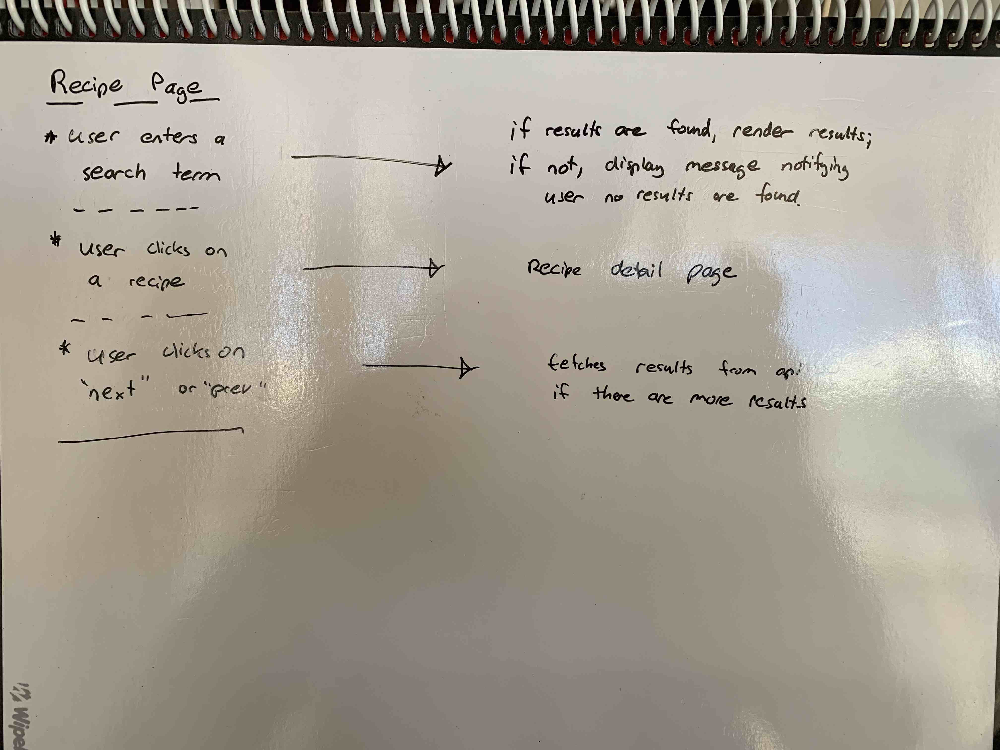
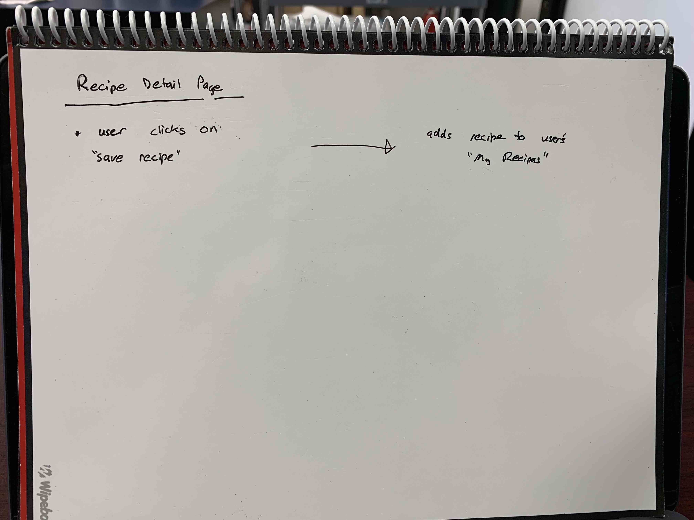
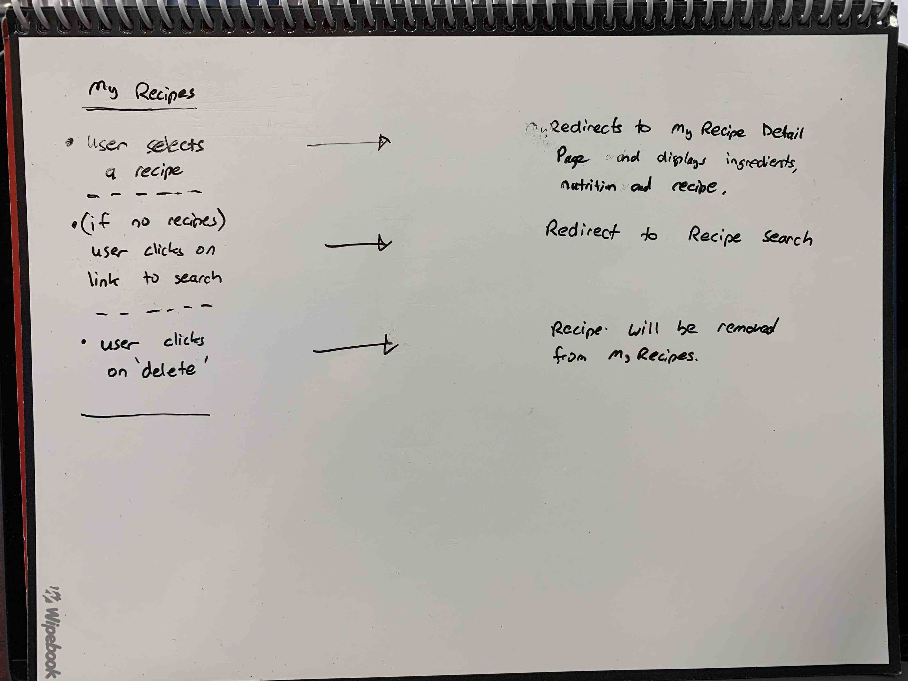
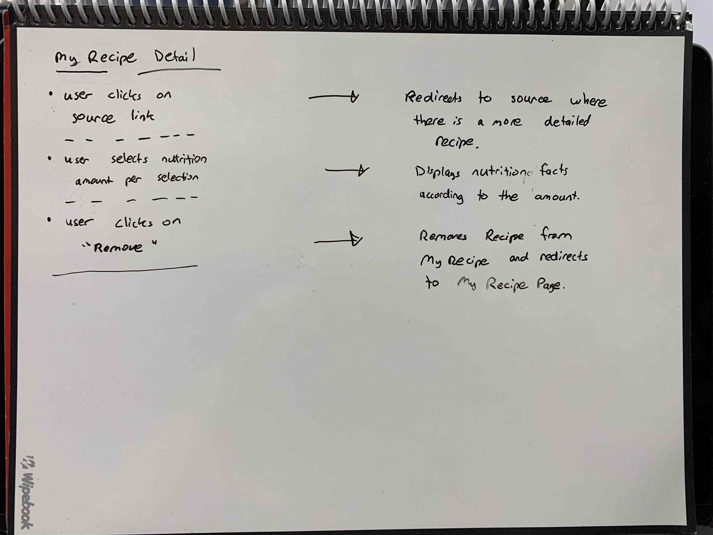

# Wireframes
[Wireframes](https://tranpeter08.github.io/getSwole-wireframes-stories/)

# User Stories

## Landing Page
- User gets a brief introduction to the app
- User can go to a link to login
- User can go to a link to register

## Login Page
- User can enter the correct credentials and log in
- If user doesn't have an account, user can go to a link to register

## Registration Page
- User creates a username, password and other user information

## Workout Page
- User can view and update their profile
- User can view, edit and delete their workouts
- User can click on a link that will go to the exercises for a particular workout

### Exercises Sub Page
- User can view, edit, and delete the exercises for a particular workout

## Nutrition
- User can search nutrition facts for a food or product

## Recipes
- User can search for recipes
- User can click on a recipe for addition details
- User can add the recipe to "My Recipes"

## My Recipes
- User can view their saved recipes

# User Flow
||||
|:---:|:---:|:---:|
| Landing | Login | Register |
||||
| Workout | Exercise | Nutrition |
||||
| Recipes | Recipe Detail | |
| |||
|My Recipes|My Recipe Detail||